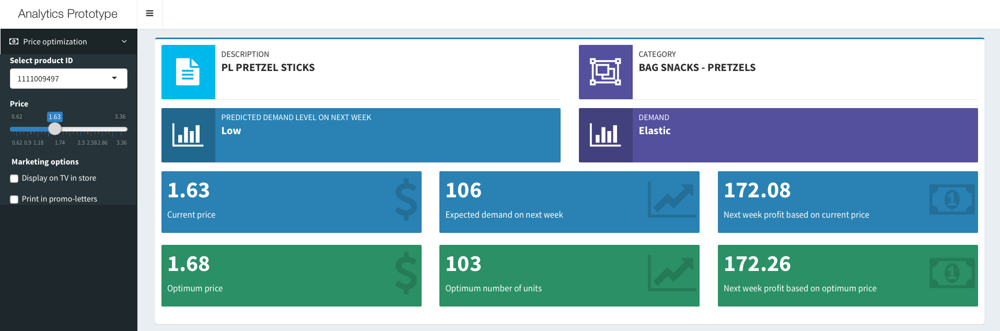
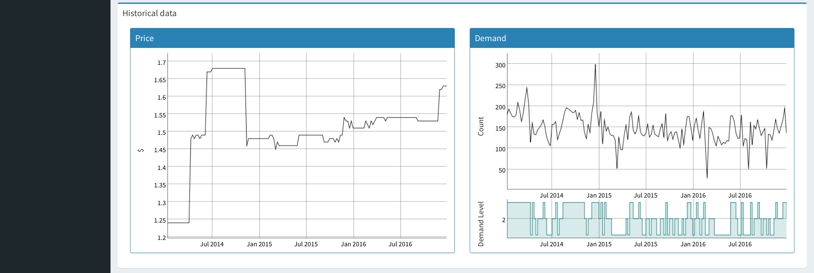
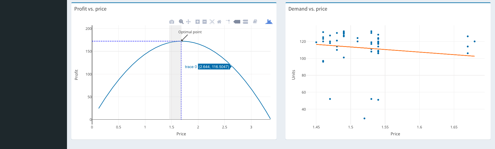

# Shiny app for Price Optimization

Price optimization is the use of mathematical analysis by a company to determine how customers will respond to different prices for its products and services through different channels. It is also used to determine the prices that the company determines will best meet its objectives such as maximizing operating profit. The data used in price optimization includes operating costs, inventories and historic prices and sales. Price optimization practice has been implemented in industries including retail, banking, airlines, casinos, hotels, car rental, cruise lines and insurance. (<https://en.wikipedia.org/wiki/Price_optimization>)

## Libraries

In the application we use the next libraries:

* shiny
* shinyjs
* shinydashboard (version 0.5.3)
* plotly
* DT
* dygraphs
* xts
* data.table
* dplyr
* plotly
* ggplot2
* prophet
* lme4

## Dataset

You can download an initial dataset from [Dunnhumby](https://www.dunnhumby.com), we use dataset [Breakfast at the Frat](https://www.dunnhumby.com/sourcefiles).

## Application look





## Docker install ##

1. Get application source code:
```bash
git clone https://github.com/zikrach/price-optimization-shiny
cd price-optimization-shiny/
```

2. Build docker image:
```bash
docker build -t price_optimization .
```

3. Run docker image:
```bash
docker run --rm -p 3838:3838 price_optimization
```

4. Open your favorite browser and navigate to the `http://127.0.0.1:3838/price_optimization/`
